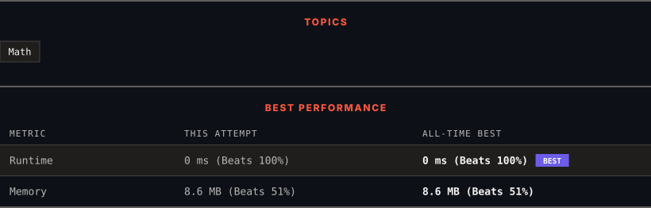

# 3870. Count Commas in Range

      

---

<picture>
  <source media="(prefers-color-scheme: dark)" srcset="panel-dark.svg">
  <source media="(prefers-color-scheme: light)" srcset="panel-light.svg">
  
</picture>

> **New personal best** — Runtime improved on this submission.

---

### SOLUTIONS (1)

| # | File | Language | Date |
|:-:|------|:--------:|:----:|
| 1 | [sol1.cpp](./sol1.cpp) | `C++` | 2026-09-08 ← **latest** |

---

### PROBLEM DESCRIPTION

You are given an integer `n`.

Return the **total** number of commas used when writing all integers from `[1, n]` (inclusive) in **standard** number formatting.

In **standard** formatting:

	- A comma is inserted after **every three** digits from the right.

	- Numbers with **fewer** than 4 digits contain no commas.

 

**Example 1:**

**Input:** n = 1002

**Output:** 3

**Explanation:**

The numbers `"1,000"`, `"1,001"`, and `"1,002"` each contain one comma, giving a total of 3.

**Example 2:**

**Input:** n = 998

**Output:** 0

**Explanation:**

All numbers from 1 to 998 have fewer than four digits. Therefore, no commas are used.

 

**Constraints:**

	- `1 <= n <= 10^5`

---

Auto-synced by <strong>LeetSync</strong> · Built by <a href="https://deveshsamant.in/">Devesh Samant</a>

